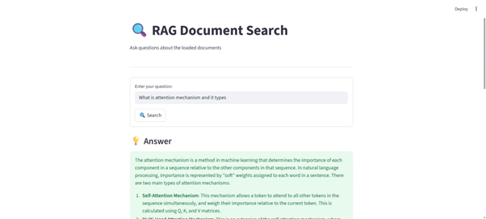
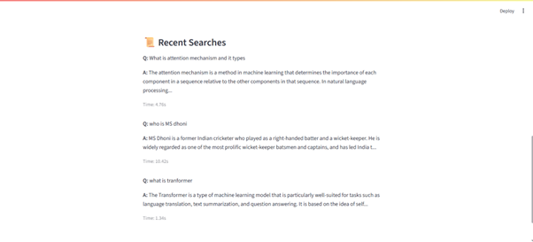

# Agentic RAG Document Search System



## Overview

An advanced Retrieval-Augmented Generation (RAG) system that combines document retrieval with large language models to provide accurate and context-aware answers. The system can process documents from various sources, create vector embeddings, and use a graph-based approach to retrieve and generate responses.

## Features

- **Multi-source Document Ingestion**: Load documents from URLs, PDFs, and text files
- **Intelligent Chunking**: Smart text splitting with configurable chunk sizes and overlaps
- **Vector Search**: FAISS-based vector store for efficient similarity search
- **Agentic Workflow**: Graph-based workflow for flexible and dynamic question answering
- **Web Interface**: Streamlit-based UI for easy interaction
- **Fallback to Web Search**: Automatically searches the web when local knowledge is insufficient

## Tech Stack

- **Framework**: LangChain, LangGraph
- **Vector Store**: FAISS (CPU)
- **Embeddings**: Sentence Transformers
- **LLM**: OpenAI (configurable to other providers)
- **Web Framework**: Streamlit
- **Document Processing**: BeautifulSoup4, PyPDF, Unstructured
- **Environment**: Python 3.9+

## Project Structure

```
.
├── data/                  # Directory for storing documents and data
├── img/                   # Screenshots and images
├── src/
│   ├── config/            # Configuration settings
│   ├── document_ingestion/ # Document loading and processing
│   ├── graph_builder/     # Graph-based workflow construction
│   ├── node/              # Custom nodes for the graph
│   ├── state/             # State management
│   └── vectorstore/       # Vector store implementation
├── .env.example          # Environment variables template
├── main.py               # Command-line interface
├── requirements.txt      # Python dependencies
└── streamlit_app.py      # Web interface
```

## Getting Started

### Prerequisites

- Python 3.9+
- pip (Python package manager)

### Installation

1. Clone the repository:

   ```bash
   git clone <your-repo-url>
   cd End-to-End-RAG-Document-Search
   ```

2. Create and activate a virtual environment:

   ```bash
   python -m venv .venv
   source .venv/bin/activate  # On Windows: .venv\Scripts\activate
   ```

3. Install dependencies:

   ```bash
   pip install -r requirements.txt
   ```

4. Set up environment variables:
   ```bash
   cp .env.example .env
   ```
   Edit `.env` and add your OpenAI API key and other configurations.

### Usage

#### Web Interface

```bash
streamlit run streamlit_app.py
```

#### Command Line

```bash
python main.py
```

## Configuration

Edit the `.env` file to configure:

- `OPENAI_API_KEY`: Your OpenAI API key
- `MODEL_NAME`: LLM model to use (default: gpt-3.5-turbo)
- `CHUNK_SIZE`: Document chunk size (default: 500)
- `CHUNK_OVERLAP`: Overlap between chunks (default: 50)

## Adding Documents

1. Place PDFs in the `data/` directory
2. Or update the `DEFAULT_URLS` in `src/config/config.py` with your document URLs

## How It Works

1. **Document Processing**:

   - Documents are loaded from various sources
   - Text is split into manageable chunks
   - Chunks are converted to vector embeddings

2. **Query Processing**:

   - User questions are converted to embeddings
   - Relevant document chunks are retrieved
   - Context is passed to the LLM for answer generation

3. **Fallback Mechanism**:
   - If no relevant local documents are found, the system can:
     - Search Wikipedia
     - Perform web searches
     - Use other configured tools

## Example Screenshots

### Query Interface




## Contributing

1. Fork the repository
2. Create a feature branch (`git checkout -b feature/AmazingFeature`)
3. Commit your changes (`git commit -m 'Add some AmazingFeature'`)
4. Push to the branch (`git push origin feature/AmazingFeature`)
5. Open a Pull Request

## License

This project is licensed under the MIT License - see the [LICENSE](LICENSE) file for details.

## Acknowledgments

- LangChain for the RAG framework
- OpenAI for the language models
- Streamlit for the web interface
